Compose for Wear OS Advanced Sample
===================================
Demonstrates Compose with the Wear optimized Scaffold, Navigation, curved text, and more!

Introduction
------------

Compose for Wear OS app that demonstrates how to use Wear specific Scaffold, Navigation,
curved text, Chips, and many other composables.

Displays different text at the bottom of the landing screen depending on shape of the device
(round vs. square/rectangular).

Debug and Release Builds
------------------------

Only use the debug builds (launching from within Android Studio) with the emulator.

Measure performance only with your release builds, and never measure your debug builds. 
Run with R8 optimisation and minification turned on.

Screenshots
-----------

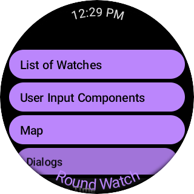
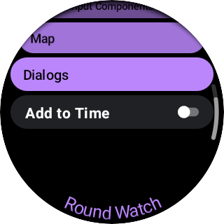
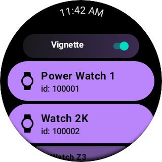
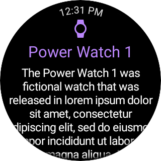

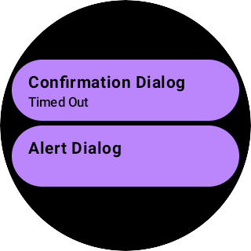
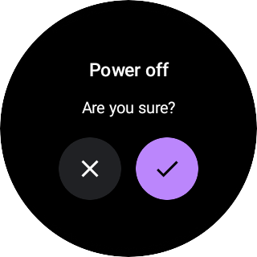
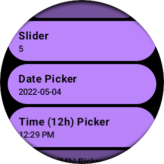
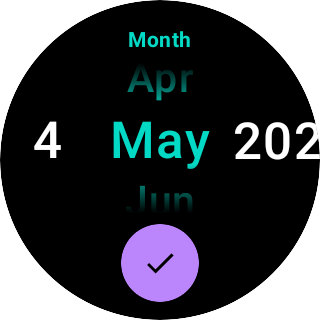
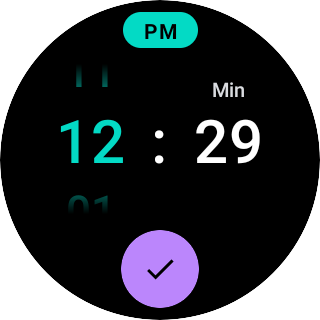
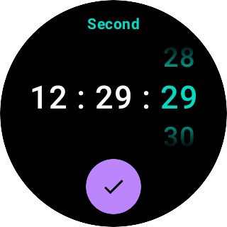

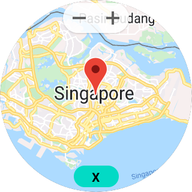

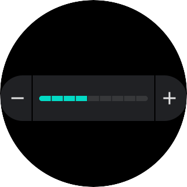

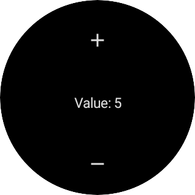

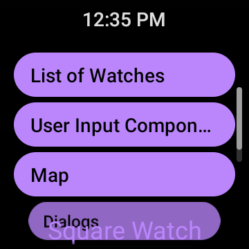 
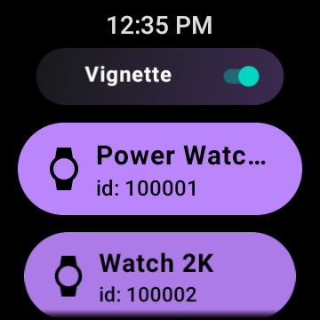 
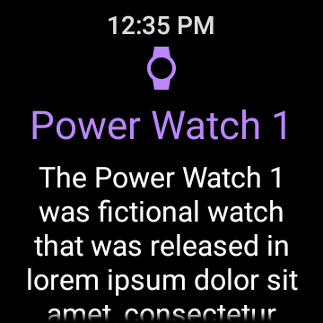 

Getting Started
---------------

This sample uses the Gradle build system. To build this project,
use the "gradlew build" command or use "Import Project" in Android Studio.

